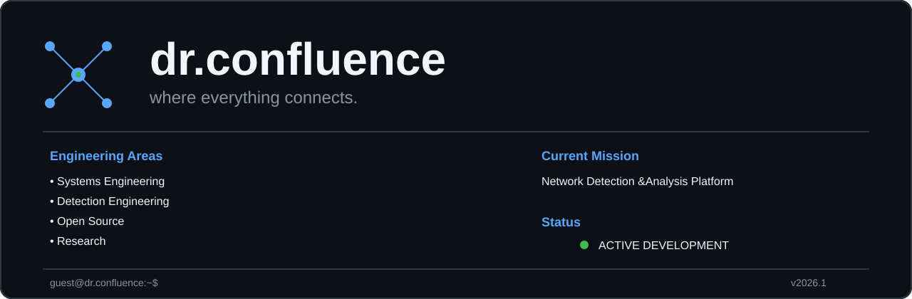

<!-- ========================= HERO ========================= -->

  

Building open-source systems for networking, Linux, detection engineering and AI.

---

# About

Welcome to **dr.confluence**.

I'm **Rohit**, an open-source engineer focused on building practical systems software. Every repository in this organization is designed to solve a real engineering problem while remaining easy to understand, extend, and document.

My work spans networking, Linux systems, packet analysis, detection engineering, backend infrastructure, and privacy-first AI systems.

Instead of maintaining isolated repositories, I build a connected ecosystem where each project contributes to a larger engineering vision.

  

# Engineering Focus

| Domain | Focus |
|---------|-------|
| Systems | Linux, Bash, Python |
| Networking | TCP/IP, Socket Programming, Packet Analysis |
| Security | Detection Engineering, Log Analysis |
| Infrastructure | Docker, PostgreSQL, GitHub Actions |
| AI | Local LLMs, Multi-Agent Systems |
| Engineering | Clean Architecture, Documentation, Automation |

  

# Featured Systems

> *(Project cards will be added in Part 2B.)*

  

# Engineering Ecosystem

> *(Architecture diagram will be added in Part 2C.)*

  

# Current Focus

- Improving PacketSnifferAnalyzer
- Building NDAP
- Expanding SOVEREIGN
- Standardizing documentation
- Strengthening testing and automation

  

# Connect

- GitHub — https://github.com/Rohit30Confluence
- LinkedIn — https://www.linkedin.com/in/rohitdinde/
- Portfolio — https://rohit30confluence.github.io

---

  

