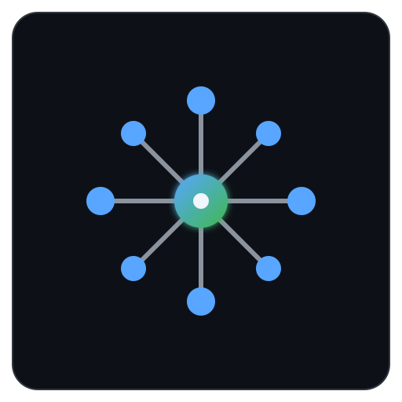
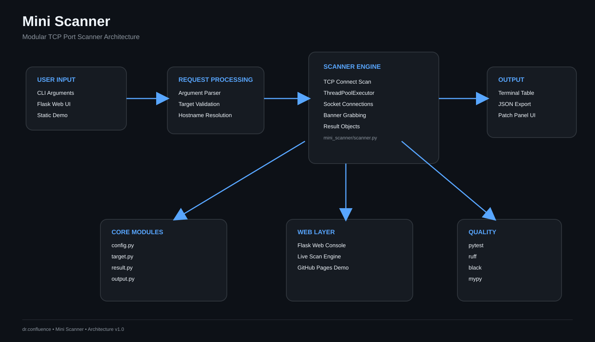

<!-- ========================================================= -->
<!-- dr.confluence -->
<!-- GitHub Profile Repository -->
<!-- ========================================================= -->

<p align="center">


</p>

<p align="center">

# dr.confluence

### where everything connects.

Building open-source systems focused on Linux, Networking, Detection Engineering and Artificial Intelligence.

</p>

---

# About

Welcome.

I'm **Rohit**, an engineer passionate about understanding how systems work beneath the surface.

Rather than building isolated repositories, I design projects that belong to a connected engineering ecosystem. Each repository exists to solve a practical problem while teaching the underlying concepts through documentation, architecture, and clean implementation.

My long-term goal is to create an ecosystem of reusable open-source software centered around networking, Linux, detection engineering, backend systems, automation, and AI.

Every repository should be understandable.

Every repository should be documented.

Every repository should be extensible.

---



# Engineering Domains

This ecosystem is organized around several engineering domains rather than disconnected technologies.

| Domain | Description |
|---------|-------------|
| Linux | System administration, automation, internals and tooling |
| Networking | TCP/IP, sockets, packet capture and analysis |
| Detection Engineering | IDS concepts, log analysis and attack detection |
| Backend Systems | APIs, databases and distributed services |
| Artificial Intelligence | Local AI systems, orchestration and automation |
| Open Source | Documentation, collaboration and engineering standards |

---

# Core Technologies

Languages

- Python
- Bash
- SQL
- C
- C++

Platforms

- Linux
- Docker
- Raspberry Pi

Databases

- PostgreSQL
- MySQL

Networking

- TCP
- UDP
- IPv4
- Packet Capture
- Wireshark

Engineering

- Git
- GitHub
- GitHub Actions
- FastAPI
- Flask

---

# Featured Systems

The following repositories form the foundation of the dr.confluence ecosystem.

---

<p align="center">


</p>

## PacketSnifferAnalyzer

Network traffic inspection platform focused on protocol analysis, visualization and extensibility.

Current direction

- Live Capture
- PCAP Analysis
- Flow Statistics
- Protocol Parsing
- Dashboard
- Plugin Architecture

Repository

https://github.com/Rohit30Confluence/PacketSnifferAnalyzer

---

<p align="center">



</p>

## Mini Scanner

A modular TCP scanner demonstrating scalable Python architecture and concurrent network scanning.

Features

- TCP Connect Scan
- Banner Grabbing
- ThreadPoolExecutor
- JSON Export
- Flask Dashboard

---

<p align="center">


</p>

## Log Analyzer & Attack Detection

Detection pipeline designed to identify suspicious behavior inside Apache access logs.

Current capabilities

- SQL Injection Detection

- Cross Site Scripting Detection

- Brute Force Detection

- Anomaly Detection

- FastAPI Backend

---

<p align="center">


</p>

## NDAP

Network Detection & Analysis Platform

NDAP represents the evolution of previous networking projects into a unified detection platform.

Research areas include

- Packet Processing

- Detection Rules

- Modular Pipelines

- Event Processing

- Analytics

---

<p align="center">


</p>

## SOVEREIGN

Privacy-first local AI engineering platform.

Areas of development

- Multi-Agent Systems

- Memory

- Local LLM

- Engineering Automation

- Research Assistant

---


# Engineering Ecosystem

<p align="center">


</p>

The repositories are intentionally connected.

PacketSnifferAnalyzer explores packet inspection.

Mini Scanner focuses on reconnaissance.

Log Analyzer expands detection into application logs.

NDAP integrates multiple networking and detection components into a unified platform.

SOVEREIGN extends the ecosystem toward intelligent engineering automation.

---


# Engineering Philosophy

This ecosystem follows several principles.

## Documentation First

Software should be understandable.

Documentation is treated as part of the product.

---

## Architecture Before Code

Every project begins with architecture.

Implementation follows design.

---

## Open Engineering

Development happens publicly.

Mistakes, redesigns and improvements remain visible.

---

## Reusable Components

Projects should share ideas rather than duplicate implementations.

---

## Security by Design

Security is considered during architecture rather than added later.

---

## Continuous Improvement

Every repository should evolve through better engineering rather than increasing complexity.

---


# Current Focus

Current engineering priorities include

- Improving PacketSnifferAnalyzer

- Building NDAP

- Expanding SOVEREIGN

- Improving Documentation

- Architecture Diagrams

- GitHub Actions

- Testing

- Developer Experience

---


# Repository Standards

Every repository aims to include

✓ README

✓ Documentation

✓ Architecture

✓ Testing

✓ Continuous Integration

✓ Security Policy

✓ Contribution Guide

✓ License

✓ Changelog

✓ API Documentation

✓ Examples

✓ Screenshots

✓ Roadmap

✓ Issues

✓ Discussions

---

# Documentation

Additional documentation

```
